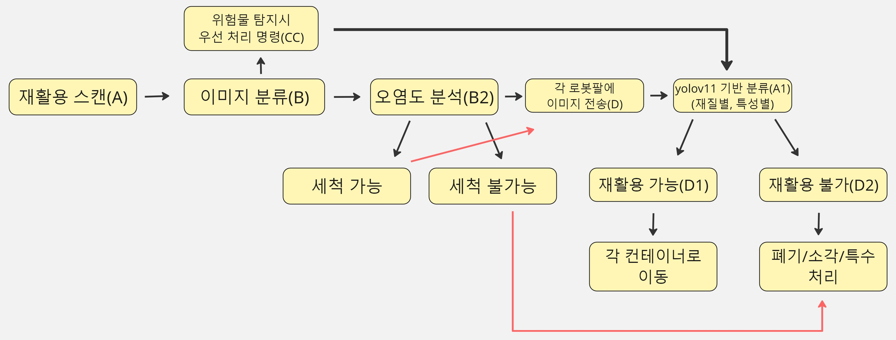

# ♻️ REDAM: AI 기반 재활용 쓰레기 분류 시스템

> **Redam**은 AI 기반으로 재활용 쓰레기를 자동 인식하고, 분류하여 로봇팔로 자동 선별하는 스마트 시스템입니다. YOLOv11 객체 탐지 모델과 Arduino 서보모터를 연동하여 실시간으로 분리수거를 수행합니다.

---

## 🧠 시스템 아키텍처

Redam 시스템은 다음과 같은 흐름으로 구성됩니다:

1. 📸 **Camera**: 쓰레기 이미지 실시간 수집
2. 🤖 **YOLOv11 Model**: 객체 탐지 및 재활용 품목 분류
3. 🏷️ **Object Classification**: 클래스 및 위치 추출
4. 📍 **Coordinates Extraction**: 중심 좌표 계산
5. ⚙️ **Arduino Servo Controller**: 서보 제어
6. 🗑️ **Sorting Mechanism**: 분리수거 동작 수행

### 🔽 구조 다이어그램



---

## 📁 주요 기능

- 18종 이상의 재활용 쓰레기 분류 (플라스틱, 유리병, 금속, 종이 등)
- YOLOv11 모델 기반 실시간 객체 감지
- 클래스별 점진 학습, 랜덤 학습, 샘플링 실험 포함
- 좌표 추출 후 Arduino 서보모터 제어
- 모델 성능 시각화 및 결과 리포트 자동 생성

---

## 🔬 실험 코드 구성

| 경로 | 설명 |
|------|------|
| `progressive_training/progressive_training.py` | 클래스별 점진 학습 코드 |
| `random_training/random_train.py` | 랜덤 클래스 조합 학습 코드 |
| `sampling_training/sampling_train.py` | 균형 샘플 기반 훈련 (선택사항) |
| `evaluation/eval_metrics.py` | 성능 평가 및 mAP 계산 |
| `utils/plot_f1.py` | F1 스코어 시각화 도구 |

---

## 🚀 실행 방법

```bash
# 패키지 설치
pip install -r requirements.txt

# 예시: 점진 학습 실행
python progressive_training/progressive_training.py
