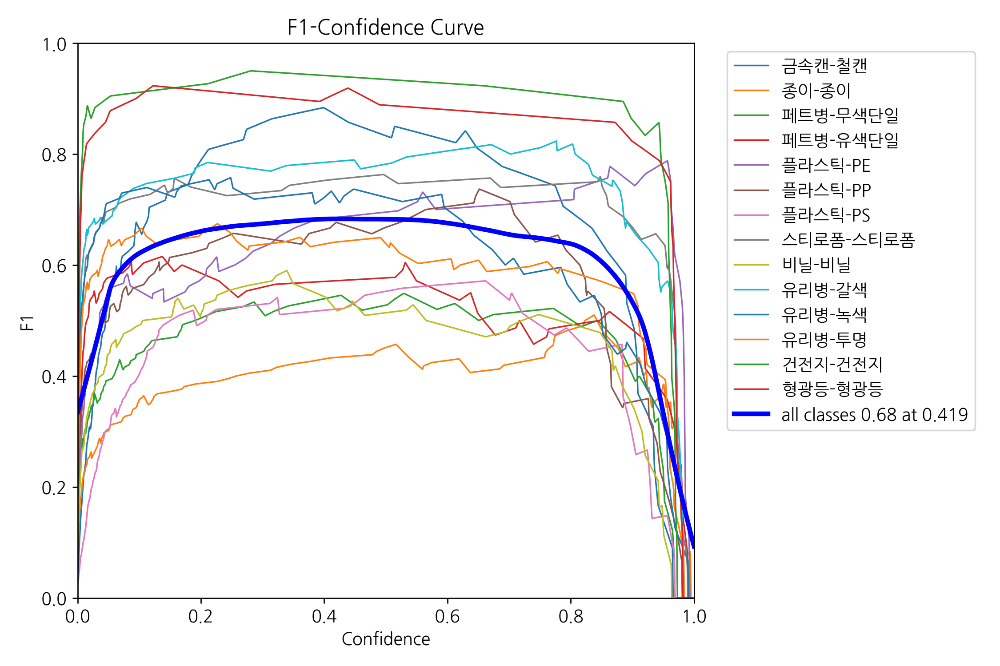
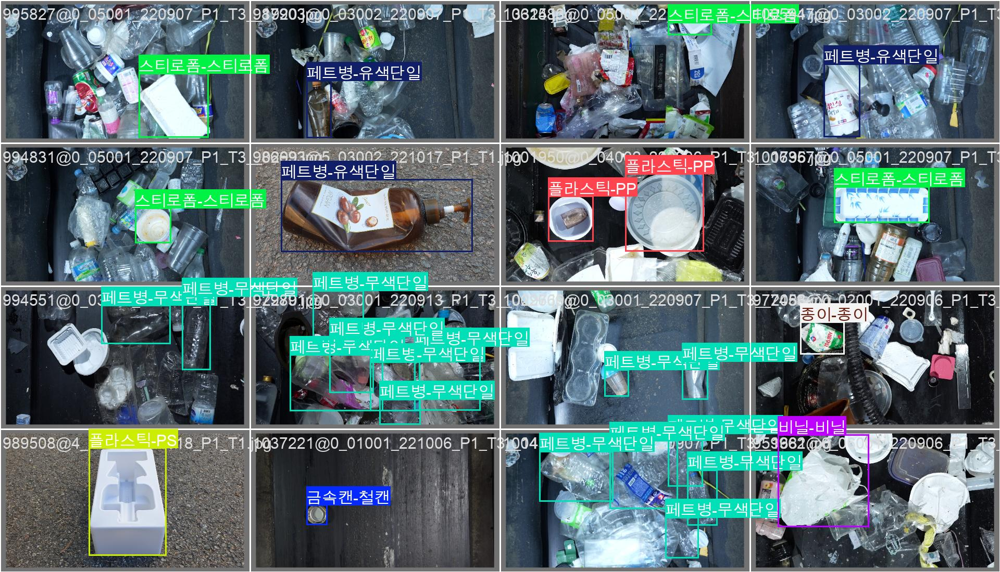
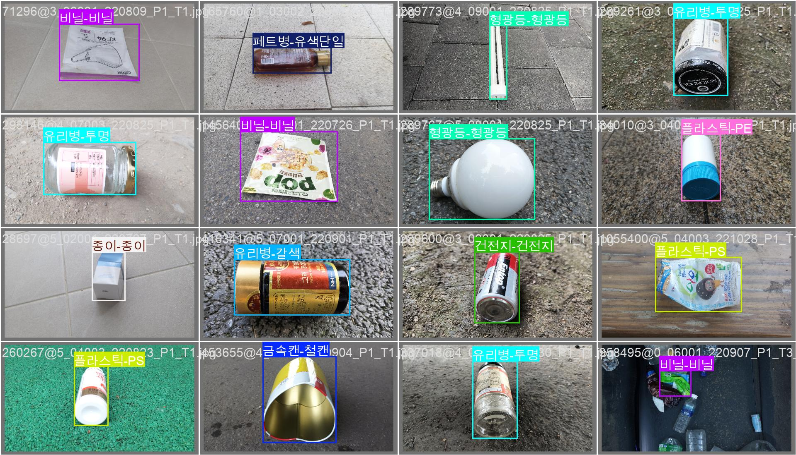

# ♻️ REDAM: AI 기반 재활용 쓰레기 분류 시스템

> **REDAM**(Recycling DAM)은 YOLOv11 기반 객체 탐지, 오염도 분석, 좌표 추출 및 로봇팔 제어를 통해 재활용 쓰레기를 자동으로 분류하는 지능형 분류 시스템입니다.  
> 본 시스템은 실시간 카메라 입력부터 실제 분류 동작까지 전 과정이 자동화되어 있어 스마트 환경 구축에 기여합니다.

---

## 🧠 시스템 아키텍처

Redam 시스템은 다음과 같은 컴포넌트로 구성됩니다:

- 📸 **Camera**: 실시간 쓰레기 이미지 촬영
- 🧠 **YOLOv11 Model**: 객체 탐지 및 분류
- 🏷️ **Object Classification**: 탐지된 객체의 클래스 추론
- 🎯 **Coordinates Extraction**: 탐지된 객체의 중심 좌표 추출
- ⚙️ **Arduino Servo Controller**: 서보 모터 제어로 분리 동작 수행
- 🗑️ **Sorting Mechanism**: 쓰레기 자동 분리 컨베이어 또는 로봇팔

### 🔽 시스템 다이어그램

---

## 🔄 전체 시스템 프로세스

Redam은 단순 객체 탐지뿐 아니라, 오염도 판단, 세척 여부 결정, 로봇팔 제어까지 포함된 End-to-End 자동화 프로세스를 갖추고 있습니다.

| 단계 | 설명 |
|------|------|
| 📷 **재활용 스캔(A)** | 쓰레기 이미지를 카메라로 촬영 |
| 🔍 **YOLO 분류(B)** | 객체 탐지 및 위험물 탐지 수행 |
| 🚨 **위험물 탐지 시(CC)** | 즉시 사용자 알림 또는 별도 처리 |
| 🧼 **오염도 분석(B2)** | 오염 상태 판단 (세척 필요 여부) |
| ♻️ **세척 가능 시** | 로봇팔로 자동 분류 좌표 전달(D) |
| 🔄 **YOLO 기반 정밀 분류(A1)** | 세부 재질 및 특성 기반 분류 |
| ✅ **재활용 가능(D1)** | 자동 분리수거 컨테이너로 이동 |
| ❌ **재활용 불가(D2)** | 폐기 또는 특수 처리 |

---

## 🧪 학습 코드 구성

| 폴더 경로 | 설명 |
|-----------|------|
| `progressive_training/` | 클래스별 점진 학습 (한 클래스씩 순차 학습) |
| `random_training/` | 무작위 클래스 조합으로 학습 |
| `sampling_training/` | 균형 샘플링 기반 학습 (데이터 편향 보정) |
| `evaluation/` | (예정) 성능 비교 지표 도구 |
| `dataset_preparation/` | (예정) JSON → YOLO 변환기 및 샘플러 |
| `utils/` | (예정) F1 그래프, 시각화 툴 |

---

## 📊 성능 결과 시각화

다양한 학습 전략의 성능은 아래 시각화를 통해 확인할 수 있습니다.

### 🔸 F1 Score Curve  
모델의 정밀도(Precision)와 재현율(Recall)을 통합한 F1 점수의 변화 추이를 시각화한 그래프입니다.  

### 🔸 추론 결과 예시  
아래 이미지는 학습된 모델이 실제로 예측한 바운딩 박스를 보여줍니다.  
  

> 추가적인 실험 결과와 지표는 `docs/` 폴더에서 확인할 수 있습니다.

---

## ⚠️ 모델 파일 주의사항

> **❗ 현재 `best.pt` 모델 파일은 저장소에 포함되어 있지 않습니다.**  
> 본 모델은 **A100 서버에서 학습된 결과물**로, 저장소만으로는 추론 실행이 불가능합니다.
>
> 🔹 추론을 원하시는 경우:
> - 현재로서는 `best.pt` 파일을 구할 수 있는 방법이 없습니다.
> - 코드 실행은 가능하지만, 모델을 직접 학습하여 `best.pt`를 생성해야 합니다.
> - 모델 추론을 시도하려면 `progressive_training.py` 또는 기타 학습 코드를 통해 새롭게 모델을 학습한 후 `.pt` 파일을 생성해야 합니다.

---

